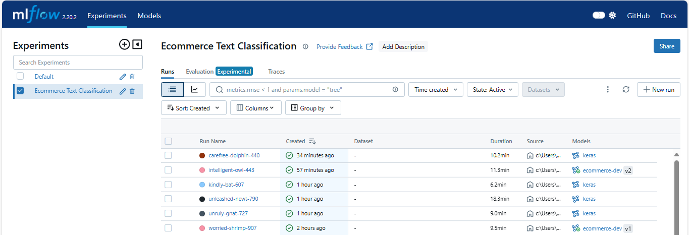
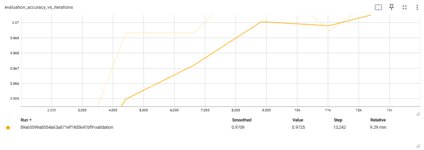

# Ecommerce Text Classification with Keras and MLflow

This project involves building a text classification model using Keras and TensorFlow for classifying e-commerce product categories. MLflow is used for experiment tracking and logging the model. NLP techniques like tokenization and embedding is used for feature extraction from text data.

## Libraries

```
keras
tensorflow
scikit-learn
mlflow
nltk
pandas
numpy
```

## Dataset

The dataset consists of two columns:

1. **Category**: The category of the product ('Household', 'Books', 'Clothing & Accessories', 'Electronics').
2. **Text**: A textual description of the product.

The dataset has 50,425 entries, which include the product category and the text associated with the product.

[Data source](https://www.kaggle.com/datasets/saurabhshahane/ecommerce-text-classification) 

### Data Preprocessing

- The text data is preprocessed by:
  - Filling missing text values with 'none'.
  - Tokenizing the text data and padding sequences to a fixed length of 250.
  - Applying an embedding layer for converting tokens into dense vectors.
- The category labels are encoded using a `LabelEncoder`.

## Model Architecture

The model is built using Keras with the following architecture:

1. **Text Vectorization**: A `TextVectorization` layer is used to tokenize the input text and convert it into integer sequences.

[Tokenization](static/tokenization.png)

2. **Embedding**: The tokenized data is passed through an embedding layer with a 64-dimensional output space.

[Embedding](static/embedding.png)

3. **Bidirectional LSTM**: A Bidirectional LSTM (Long Short-Term Memory) layer is used to capture dependencies in the text.

[Keras model](static/keras_model.png)

4. **Dense Layer**: The output of the LSTM layer is passed through a fully connected dense layer with a softmax activation to classify the input into one of the four categories.

The model is compiled with the `SparseCategoricalCrossentropy` loss function, and `accuracy` is used as the evaluation metric.

[Model compilation](static/model_compilation.png)

## Training and Experiment Tracking with MLflow

MLflow is used to track and log the experiment. The following are logged during the training process:

- **Model parameters and metrics**: Training and validation accuracy.
- **Model artifacts**: The trained Keras model is saved using `mlflow.keras.save_model`.
- **TensorBoard logs**: Logs for TensorBoard visualization.




## Evaluation

After training, the model is evaluated on the test set, and classification metrics such as precision, recall, F1-score are displayed using `classification_report` from `sklearn`.


## TensorBoard

TensorBoard is used for visualizing the training process like accuracy and loss over the training epochs. The logs are stored in the `logs` folder.



